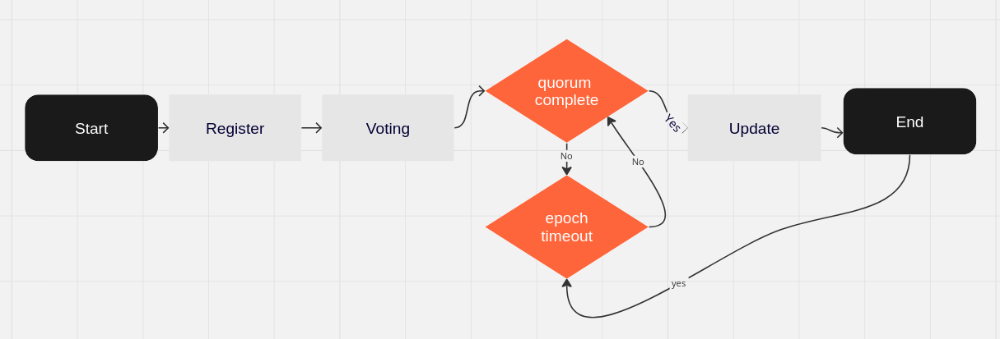

### This PR should no be merged, when approved, move to https://github.com/Topl/tips

<pre>
TIP: 3
Title: Update proposals
Author:
Status: Draft
Type: Standard
Created: 2023-07-11
License: CC-BY-4.0
</pre>

## Abstract

Update proposals can be used to introduce changes to the values of specific parameters (e.g., slot-duration ,
operational-periods-per-epoch.)
Changes to the validation rules at any level (transaction, block, or blockchain), or even changes at the consensus
protocol itself.

Protocol parameters are used to affect the operation of the Topl protocol.
They may be either updatable or non-updatable, Tip-(#TODO) detail which parameters are updatable and which are not.
For this specification is expected that updatable parameters must be changes without restarting a node instance.

Note, cardano-governance was used as reference: TODO (delete this
comment) https://github.com/input-output-hk/cardano-node/blob/master/doc/reference/cardano-governance.md

## Motivation

Operators to understand update proposal specification
TODO ask:

- is operator a good name?
- all participants in the blockchain are called operators, or there are others?
- who can submit a proposal? all, operator only, other..

## Topl Blockchain protocol version Specification, (Dion Implementation)

- `firstDigit` Significant hard fork/version change/consensus rule set change
- `secondDigit` Feature additions, bugs fixing hard forks, minor hard forks, significant soft forks, interface should
  work the same
- `thirdDigit` Minor changes

Grammar:

```
<valid version> ::= <version>
<version> ::= <firstDigit> "." <secondDigit> "." <thirdDigit>
<firstDigit> ::= <digit>
<secondDigit> ::= <digit>
<thirdDigit> ::= <digit>
<digit> ::= "0" | "1" | "2" | "3" | "4" | "5" | "6" | "7" | "8" | "9"
```

Examples: 1.0.1

Updating any protocol parameter always requires updating the protocol version according to the following rules:

* If the proposed `firstDigit` is equal to the current `firstDigit`, then the `secondDigit` version must be incremented
  by one.
* If the proposed `firstDigit` is larger than the current firstDigit, then the proposed `secondDigit` must be reset to
  zero.
* If the proposed `firstDigit` and `secondDigit` are equal to the current firstDigit/secondDigit, then the `thirdDigit`
  version must be incremented by one.
* Update proposals that neither increase the protocol version nor the software version are 'invalid' according to the
  specification, and rejected when submitted.

## Bifrost eras

Topl has come through different development eras which introduced new functionalities.
Going from one era to the next requires that new features (which might require changes in the ledger, consensus,
network, etc) are incorporated into a new node version.
For this, an update proposal must be submitted to trigger the update which is handled by the fork operation.

| Era             | Features                                                                          | Protocol | Version | Fork name |
|-----------------|-----------------------------------------------------------------------------------|----------|---------|-----------|
| monon-era-names |                                                                                   | Monon    | ???     |           |
| dion-era-names  |                                                                                   | Dion     | 0.0.1   |           |
| tetra-era-names | Users to participate in the protocol, get rewards for producing blocks by staking | Tetra    | 1.0.1   |           |

### Update proposals stages



1. Update proposal is registered: New values for some protocol parameters start with an update proposal using a
   transaction. TODO: (Define which kind of transaction, and which roles/users can submit a proposal)
2. Accumulate votes: Users sign and submit their votes. The proposal must accumulate a sufficient number of votes to be
   confirmed during `# epoch votes period process`
3. Update proposal is Confirmed (enough votes): The system records the slot number of the slot in which the
   required `min threshold` of votes was met.

- The threshold is determined by the `min threshold` protocol parameter.
- The voting process will accumulate votes during `N epoch votes process`
- if `min threshold` value is not reach at `N epoch votes process`, proposal is ignored
- if votes is greater than `min threshold` at `N epoch votes process`, protocol will be updated
  on  `# epoch quorum` + `# epoch delay`

### How to create an update proposal for Tetra. To be defined

```
Welcome to the Bifrost CLI
Please enter a command. [Quit | register | poposal]
> bifrost-cli proposal \
--filepath update.proposal.filePath \
--network networkName \
--key operatorkey \
--protocol-version-firstDigit "2" \
--protocol-version-secondDigit "0" \
--protocol-version-thirdDigit "0" \
```

Team Questions:  (this section should not be in the TIP)

- input: file with a list of updatable parameter:value
- node-cli must parse/validate the file
- output: proposal transaction, with a proposal Id
- brambl-cli: to submit the transaction

Current bifrost-tetra settings example:

```
// Settings of the protocol (consensus)
protocols {
// The _slot_ at which this protocol begins
  0 {
    f-effective = "15/100"
    vrf-ldd-cutoff = 50
    vrf-precision = 40
    vrf-baseline-difficulty = "1/20"
    vrf-amplitude = "1/2"
    chain-selection-k-lookback = 50
    slot-duration = 1000 milli
    forward-biased-slot-window = 50
    operational-periods-per-epoch = 2
    kes-key-hours = 9
    kes-key-minutes = 9
  }
}
```

### TODO Begin: this section should be deleted
- 

- do define how and where protocol version should be model.
    - Bitcoin: Block Headers https://en.bitcoin.it/wiki/Protocol_documentation#version
        - When a node creates an outgoing connection, it will immediately advertise its version. The remote node will
          respond with its version. No further communication is possible until both peers have exchanged their version.
    - cardano-shelley:
      header.headerBody.protocol_version: https://github.com/input-output-hk/cardano-ledger/blob/master/eras/shelley/test-suite/cddl-files/shelley.cddl#L39

- field by field, double check if n nodes could live with different values simultaneous , define updatable parameters o
  no
- do define a specific transaction to create a proposal
- do define a specific transaction to vote
- do define a peer to peer message to notify peers that a new proposal was published
- do define a peer to peer message to notify peers that a new proposal reach consensus and should be applied on slot...
- do define a peer to peer message to notify peers that a new proposal do not reach consensus and should not be applied
- do define a storage to handle current/coming protocol settings
- do define node-rpc with current protocol version, and settings
- do define node-rpc with available protocol proposals
- do define node-rpc with protocol proposal information, id provided, should return status, votes, ...
-
- check how protocol settings are being load, right now we are using a config at start up time, how to replace them at
  runtime
- do define
- do define
- do define
- do define

Previous experience:

1. how did you migrate from monon to dion?
1.1 There was no migration from monon, it was a complete restart

2. has the fork management code in dion ever been used, or did we just manually upgrade the nodes since we owned them
   all?
2.1 The fork management code was tested and used in a simulated environment but never on a mainet. I manually ungraded
   the nodes since we owned them, yes.

3. what is the semantic mapping of the semver protocol version in dion? I assume hard fork.soft fork.informational, but
   that's just a guess
3.1 Yes, that mapping was enacted after v1.3.x but the jump from 1.2 to 1.3 was technically a hard fork I believe, though
   I don't recall if the top of head why I think that is the case. Anything 1.3 to 1.11 should be compatible with one
   another I believe.

### TODO End: this section should be deleted

## Copyright

We license this work under a [Creative Commons Attribution 4.0 International License](https://creativecommons.org/licenses/by/4.0/).
