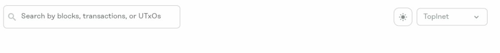

## How to Connect

In this example, we will be using Docker to run the node.

The way to connect to a testnet is by adding it as a known peer. To do this via CLI, you can use `--knownPeersUnresolvedDns testnet.topl.co:9085`. You will also need to pass the `--config` which contains the genesis block information and other configuration requirements for the given testnet.

The testnet configs are hosted on GitHub https://github.com/Topl/Genesis_Testnets which can be automatically downloaded by Bifrost using the `--config https://raw.githubusercontent.com/Topl/Genesis_Testnets/main/testnet1/config.yaml` parameter.

A full example of connecting to the node:

```
docker run -p 9085:9085 -p 9084:9084 toplprotocol/bifrost-node:2.0.0-alpha10 \
    --knownPeersUnresolvedDns testnet.topl.co:9085 \
    --config https://raw.githubusercontent.com/Topl/Genesis_Testnets/main/testnet1/config.yaml
```

## How to Get Funds

Funds can be retrieved via our Faucet. https://faucet.topl.co/#/

Detailed instructions coming soon!

## Visualize Transactions

Transactions can be viewed on our block explorer. https://explore.topl.co/#/



Select the correct network from the dropdown in the top right corner and search using the search box.

Detailed instructions coming soon!
